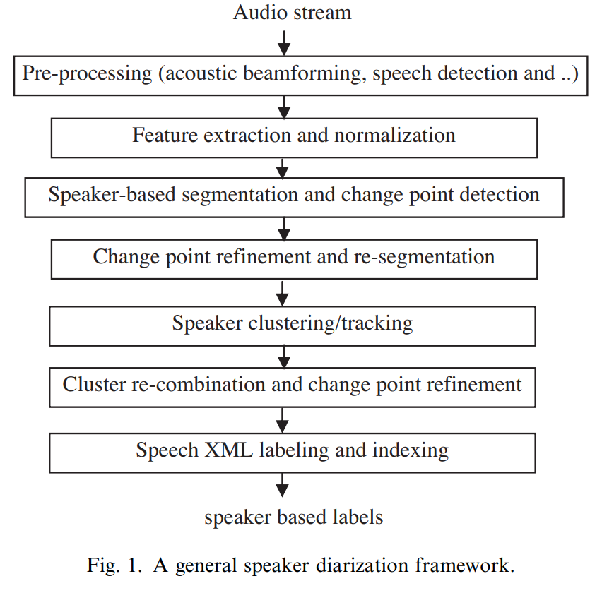

# A review on speaker diarization systems and approaches

## About

- **Speaker Indexing:** 
  - Involves speaker segmentation (one speaker per segment) and speaker clustering.
- **Segmentation-Clustering Dependency:** 
  - Errors in speaker segmentation impact speaker clustering effectiveness.
- **Features for Analysis:**
  - **MFCC** (Mel-frequency cepstral coefficients) with variable orders (12 to 24).
  - **STE** (Short Term Energy).
  - **ZCR** (Zero-Crossing Rate).
  - **Pitch** and **Spectrum Magnitude**.
  - **Line Spectrum Pairs, Perceptual Linear Prediction, Cepstral Coefficients**.
- **SAD (Speech Activity Detection):** 
  - Utilizes maximum likelihood classification with GMM. Employs two HMMs for speech/non-speech distinction.
- **SAD Subsystems:**
  - **Speech/Non-Speech Segmentation:** 
    - Uses model-based approach with one model each for speech and non-speech.
  - **Silence Detection:** 
    - Identifies silence between speakers, setting minimum time to avoid false alarms.
  - **Model-Based Segmentation:** 
    - Applies ML classification using models like UBMs, SSMs, HMMs, SVMs.
  - **Distance-Based Methods:** 
    - Analyzes distances between consecutive segments.
- **BIC and Distance Metrics:** 
  - Includes Hotelling’s T2, KL2, NLLR, weighted squared Euclidean, KL distance, Mahalanobis, ICR.
- **Threshold Determination:**
  - Formula: 
    - $\Theta_i = \frac{a}{Q} \sum_{q=0}^{Q} \text{Dist}(i - q - 1, i - q)$.
  - Preference for over-segmentation over under-segmentation.
- **Offline Algorithms:**
  - **Bottom-Up Approach:** 
    - Uses DistCE formula.
  - Gaussian distribution for each segment, analyzing cosine similarity of projection vectors.
- **SOM (Self-Organizing Maps):** 
  - Employed for speaker clustering.
- **Error Evaluation:**
  - Formula: 
    - $\text{ErrorSpkrSeg} = \frac{\sum_{\text{all segs}} \left( dur(seg) \cdot \left( \max(NReal(seg), NOut(seg)) - NCorrect(seg) \right) \right)}{\sum_{\text{all segs}} \left( dur(seg) \cdot NRef(seg) \right)}$.
- **Overlap Challenge:** 
  - Addresses with a three-state HMM-GMM system for non-speech, non-overlapped speech, and overlapped speech.

## Key findings

- General look of diarization framework :

Keep it short and clear; Include figures when necessary;

When the paper is presenting a method, include the benchmark/datasets, metrics and scores compared to other methods.
