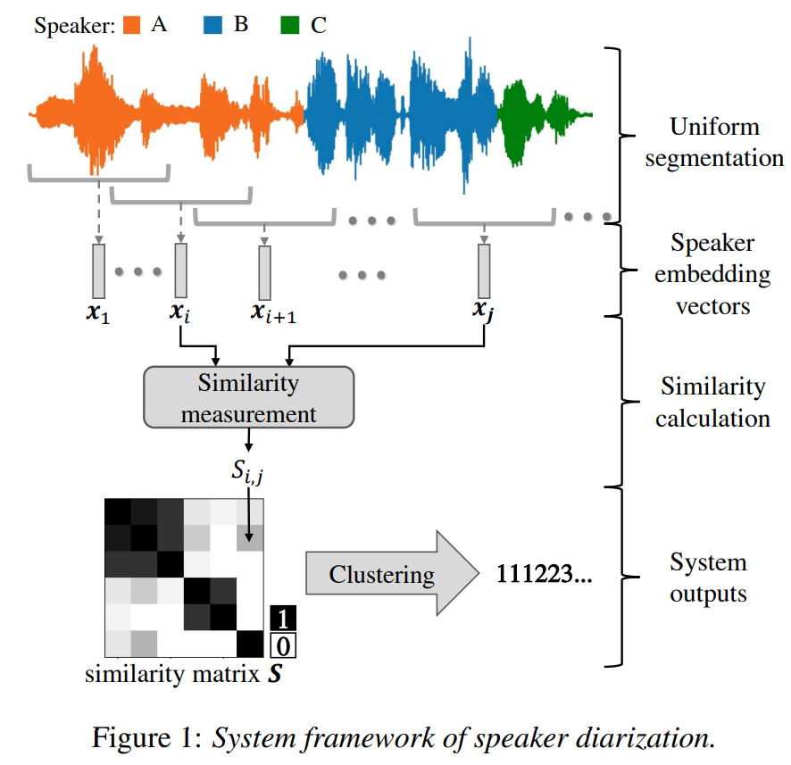
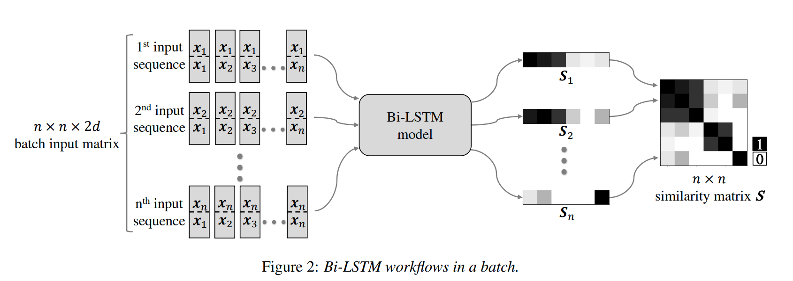
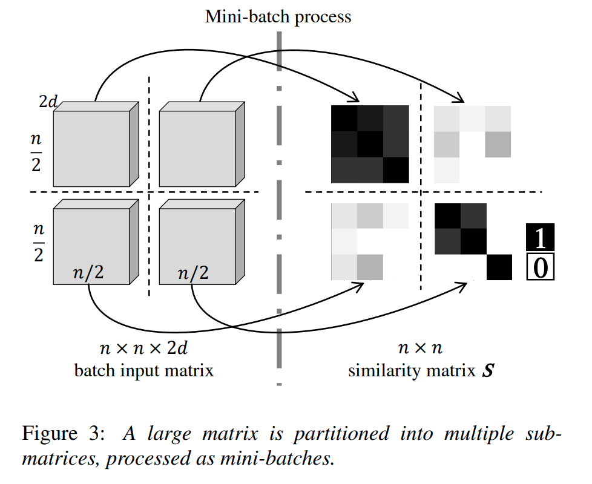

# LSTM based Similarity Measurement with Spectral Clustering for Speaker Diarization

Link: https://arxiv.org/pdf/1907.10393.pdf

**Speaker Diarization**: Differentiating speakers in conversations.

**Segmentation**: 1.5s sliding window, 750ms overlap.

**Labeling**: Dominant speaker, central 750ms segment.

    

**Bi-LSTM Network**: Sequential data processing, symmetric, captures temporal speech dynamics.

    

**Similarity Matrix Prediction**: Utilizes Bi-LSTM for determining speaker similarity, label similarity matrix is filled with 1s or 0s (if same speaker).

**Spectral Clustering**: Graph-based clustering, uses Laplacian matrix:
$$
L = D - S \\
L_{\text{norm}} = D^{-1}L
$$

**Eigenvalue Decomposition**: For identifying clusters:
- Number of clusters $k$ equals multiplicity of eigenvalue 0.
- Alternatively, set a threshold $\beta$ and count the multiplicity of all $\lambda_i$ where $\lambda_i < \beta$.
- Select eigenvectors $p_i \in \mathbb{R}^n$ corresponding to $\lambda_i$.

**K-means Clustering**: Applied to row vectors of matrix $P$ for final clustering.

**LSTM sequence size**: Fix the length $m$ of the sequence input for the LSTM and divide the similarity matrix in smaller submatrix.

    

**Denoise and smooth**: 

Make it symmetric: $$Y_{i, j} = max(S_{i, j}, S_{j, i})$$
Diffusion process:  $$Y \leftarrow YY^T$$
Normalization: $$S_{i, j} = Y_{i, j}/max_k(Y_{i, k})$$

**PLDA vs LSTM**: Comparing traditional PLDA with LSTM approach.

## Key findings
