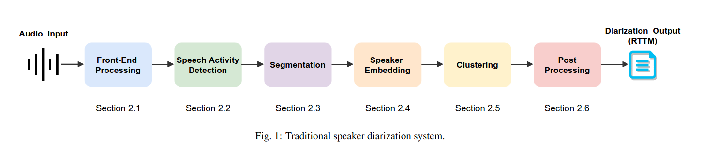
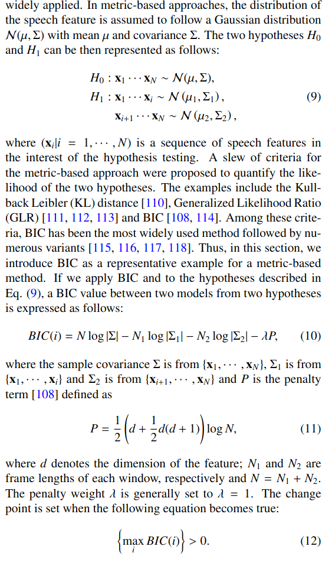

# A Review of Speaker Diarization: Recent Advances with Deep Learning

Link: https://arxiv.org/pdf/2101.09624.pdf

**TLDR;** \
Review of State of The Art deep learning methods.

## Key findings

#### Pipeline
- Processing
    - Denoising (e.g. with LSTMs)
    - Dereverberation

- Speech Activity Detection
    - Usually feature extractor + model (e.g. HMM, GMM, MLP/LSTM/CNN)
    - performance of SAD is key to diarization performance

#### Segmentation
- Speaker-change point detection
    - we test hypothesis H0 vs H1 (see [segmentation section](./mm-publi-3152.md)) \
    -> but inconsistent segment length

    

- otherwise, can just use uniform segmentation but
    - long segments = risk of multiple speakers
    - short segments = segment not representative enough of speaker

#### Speaker representation/similarity

**Traditional** (before i-vectors):
- Metrics -> GLR/BIC/KL
- GMM model applied to accoustic features (e.g. MFCCs) \
BUT method is not robust across recordings because GMM also captures acoustic noise \
-> Joint Factor Analysis (JFA)

**Modern Approach** :

JFA
- TO UNDERSTAND (see [CSAIL presentation](http://people.csail.mit.edu/sshum/talks/ivector_tutorial_interspeech_27Aug2011.pdf))
- Can use cosine similarity or log-likelihood ratio of speaker representations, or Probabilistic LDA

DNN
- Use stacked FilterBank features as inputs (stacking of fetures obtained from dividing the spectrum into bands) (e.g. Log mel-featurebank features)

#### Clustering methods

- Agglomerative Hierarchical Clustering \
-> What we saw from the 2010 paper (starting with singleton clusters and iteratively merging)
- Spectral clustering \
-> See for instance [LSTM based similarity measurement with spectral clustering](./1907_10393.md)
- kmeans generally underperforms

#### Post Processing
- Resegmentation
    - Viterbi resegmentation
    - VB-HMM was shown to be superior to Viterbi
- Fusion
    - We can fuse results together but it is non-trivial, see DOVER method

There exist multiple methods to
- enhance clustering using Deep Learning
- Learn the distance estimator with NN
- Pre/Post process (e.g. resegmentation, voice activity detection) with DL

**Some methods try to jointly learn the tasks instead of learning modules.**

Ex: Fully End-to-End Neural Diarisation (EEND) takes log mel spectrogram of a segment as input and outputs the diarization result (also possible with unbounded nb of speakers)

Also possible to perform joint ASR and Speaker Diarization (e.g. Whisper)
