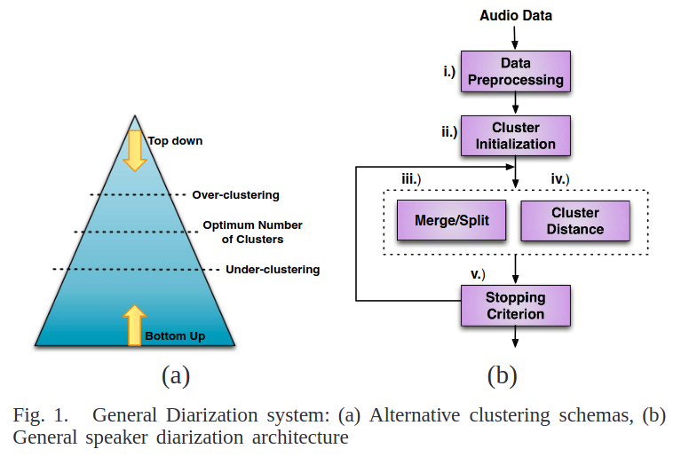

# Speaker Diarization: A Review of Recent Research

Link: http://www.eurecom.fr/fr/publication/3152/download/mm-publi-3152.pdf

## About
Review of State of The Art methods between 2005-2009

## Key elements
- Diarization problem = "who spoke when" ->
    - identification of speakers in a audio stream
    - identification of intervals during which each speaker is active

- The traditional approach seems to be (see [ChatGPT understanding](chatgpt.md)):
    - Preprocess, extract features from audio and segment audio in small sequences (few seconds with only 1 speaker)
    - Use a clustering method to generate clusters of segments: each cluster contains the list of segments corresponding to 1 speaker (unsupervised clustering)
- There are 2 main clustering approaches (fig1):
    - Bottom-up approach: we start with many clusters (e.g. 1 segment = 1 cluster) and then them merge iteratively into bigger clusters using similarity measures (until we reach a stopping criteria)
    - Top-down approach: we start with 1 cluster and iteratively split them into smaller clusters until stopping criteria (e.g. nb of clusters = number of speakers, which is what we want)
- Simple cluster initialization (uniform) leads to equivalent performance to using knn.
- Algos are iterative, oftentime cluster merging/split is followed by _viterbi realignement/adaptation_ (to investigate)
- Stopping criteria:
    - BIC
    - KL-based metrics
    - Generalized likelihood ratio?
    - $T_s$ metric
- Other information-theory based methods: aIB, sIB -> not SoTA but computationally efficient
- There exist bayesian based methods.

#### Pipeline:
- General data preprocessing (usually data specific)
    - noise reduction (e.g. Wiener filter)
    - beamforming (useless for us)
    - transformation into features (e.g. MFCC, PLP)

#### Speech Activity detection
- difference in microphone config makes SAD a non-trivial problem (energy, spectrum divergence between speech and background noise, and pitch estimation may be ineffective)
- model-based works better (e.g. LDA/SVM with MFCC) -> but need for external data
- hybrid methods (1. energy-based where there is high confidence -> 2. model based)

#### Segmentation
- We can perform hypothesis testing given 2 segments:
    - $H_0$: both segments come from the same
speaker
    - $H_1$: there are two different speakers 

- Distance metrics
    - BIC (but expensive so may only be used in second pass)
    - GLR (ratio between H1 and H0)
    - KL2 metric (symetric KL)
    - ICR (seems to be more robust than BIC-based dists)

#### System evaluation
- DER metric (Diarization Error Rate) -> sum of:
    - missed speech
    - false alarm speech
    - speaker error